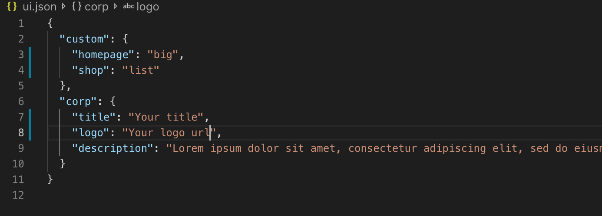

# Web Jamstack project

First mini-project of Web Pool, Epitech (MSc) Lyon, 2019

## Customization

The file ui.json define your own informations and the display you choose. Fill the "corp" fields with your name, logo, description...
Next, you have to choose one skin for the homepage, and another one for the shop list.
For homepage, values are "big" or "small"
For sop, values are "list" or "block"

